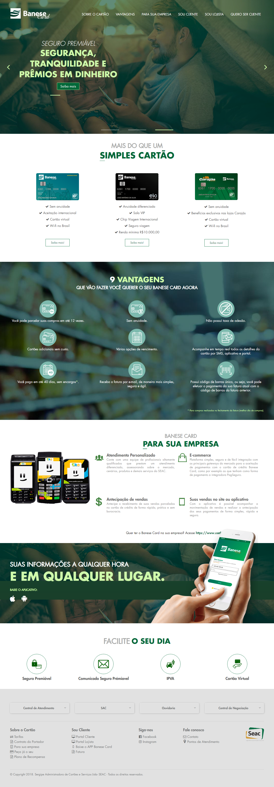

<!-- Título -->
<h1 align="center"><strong>Landing Page</strong></h1>


<!-- Badges (https://shields.io/category/version) --> 
<p align="center">

<a href="https://github.com/Phewrys/phewrys.github.io/issues"></a>
<a href="https://github.com/Phewrys/phewrys.github.io/network"></a>
<a href="https://github.com/Phewrys/phewrys.github.io/stargazers"></a>
<a href="https://github.com/Phewrys/phewrys.github.io"></a>
</p>
<h3 align="center">🚧 Em Construção... 🚧</h3>


<!-- Tópicos -->
<h1>🏁 Tópicos</h1>
<ul>
    <li><a href="#sobre">Sobre o Projeto</a></li>
    <li><a href="#funcionalidades">Funcionalidades</a></li>
    <li><a href="#layout">Layout</a></li>
    <li><a href="#preRequisitos">Pré-requisitos</a></li>
    <li><a href="#tecUtilizadas">Tecnologias Utilizadas</a></li>
    <li><a href="#canaisDigitais">Canais Digitais</a></li>
    <li><a href="#contribuicao">Contribuição</a></li>
    <li><a href="#autor">Autor</a></li>
    <li><a href="#licenca">Licença</a></li>
</ul>


<hr/>
<!-- Sobre o projeto -->
<h2 id="sobre">💻 Sobre o Projeto</h2>
<p align="justify">O <strong>Banese Card</strong> é sinônimo de inovação, pioneirismo e transparência, através de investimentos para aprimorar seus produtos e serviços, está preparado para atender as as necessidades dos nossos clientes.<p>


<hr/>
<!-- Funcionalidades -->
<h2 id="funcionalidades">⚙️ Funcionalidades</h2>

### Features:
- [x] Cabeçalho
- [x] Rodapé
- [x] Sou Cliente
- [ ] Sou Lojista
- [ ] Quero ser Cliente
- [x] Cartões
  - [x] Banese Card
  - [x] Nanquim
  - [x] Carajás
- [ ] Saiba mais
  - [x] Banese Card
  - [x] Nanquim
  - [ ] Carajás
- [ ] Modal
  - [x] Seguro Premiável
  - [ ] Comunicado Seguro Prémiavel
  - [ ] IPVA
  - [x] Cartão Virtual


<hr/>
<!-- Layout -->
<h2 id="layout">🎨 Layout</h2>

Para acessar a aplicação, clique [aqui](https://wwws.banesecard.com.br/Home/).

<h1 align="center">
  
</h1>


<hr/>
<!-- Pré-requisitos -->
<h2 id="preRequisitos">👉 Pré-requisitos</h2>

Antes de começar, você vai precisar ter instalado em sua máquina as seguintes ferramentas:
* [Git](https://git-scm.com)
* [Visual Studio](https://visualstudio.microsoft.com/)
 
Além disto é bom ter um editor para trabalhar com o código, é recomendável utilizar o [VSCode](https://code.visualstudio.com/).

```bash
# Crie uma pasta onde deverá ficar o projeto (recomenda-se cria na unidade C: com o nome Git)

# Abra o Terminal (Windows+R > digite cmd > OK)

# Entre na pasta Git
$ cd ../..
$ cd Git

# Clone este repositório
$ git clone https://repositorios.banese.com.br/Seac/ssc-canal-landingpage.git
```


<hr/>
<!-- Tecnologias Utilizadas -->
<h2 id="tecUtilizadas">🛠 Tecnologias Utilizadas</h2>

As seguintes ferramentas foram usadas na construção do projeto:

- [C#](https://docs.microsoft.com/en-us/dotnet/csharp/)
- [CSS](https://www.w3.org/Style/CSS/Overview.en.html)
- [HTML](https://www.w3.org/html/)
- [JQuery](https://jquery.com/)
- [Bootstrap](https://getbootstrap.com.br/)
- [Javascript](https://www.javascript.com/)


<hr/>
<!-- Canais Digitais -->
<h2 id="canaisDigitais">Canais Digitais</h2>

<h3><i>WEB</i></h3>

| NOME | URL |
| ------ | ------ |
| Landing Page | https://www.banesecard.com.br/ |
| Portal Cliente | https://www.banesecard.com.br/PortalCliente/ |
| Portal TKS | https://www.usetks.com.br/PortalLojista/Login |
| Portal Terceiros | https://www.banesecard.com.br/PortalTerceiros/ |

<h3><i>APPs Nativos</i></h3>

| NOME | URL |
| ------ | ------ |
| App BaneseCard | API: https://www.banesecard.com.br/PortalCliente/api |
| APP Lojista | API: https://www.usetks.com.br/PortalLojista/api |

<h3><i>APPs Híbridos (React-Native)</i></h3>

| NOME | URL |
| ------ | ------ |
| App Voucher | API: https://www.banesecard.com.br/portalbeneficios/api |
| App Metas | API: https://www.banesecard.com.br/PortalAssistente/api |
| App TKS Pay | (Ainda está em desenvolvimento) |


<hr/>
<!-- Contribuição -->
<h2 id="contribuicao">👨‍💻 Contribuição</h2>


<hr/>
<!-- Autor -->
<h2 id="autor">🦸 Autor</h2>


<hr/>
<!-- Licença -->
<h2 id="licenca">📝 Licença</h2>
<small><i>© Copyright 2020. Sergipe Administradora de Cartões e Serviços Ltda - SEAC | Todos os direitos reservados.</i>
</small>
